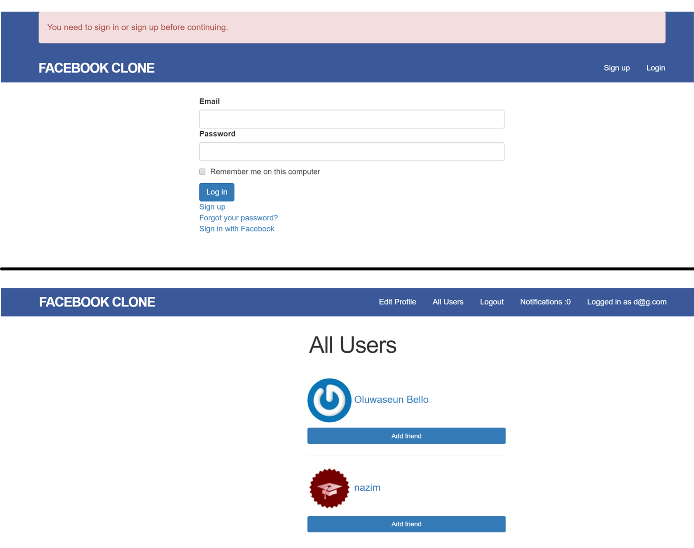

# Odin Facebook

> A Facebook-like, built to learn Ruby on Rails.

[//]: # (Screenshot, Application concept art etc)


[//]: # (Live Demo link)
<p align="center">
  <a href="https://juz-odin-facebook.herokuapp.com/">Live Demo</a>
</p>

## Built With

* HTML
* CSS
* JavaScript
* Ruby on Rails

## Get Started

### Setup

1. Clone this repository.

```bash
git clone git@github.com:juzQrios/odin-facebook.git
```

2. Installation dependencies.

```bash
bundle install --without production
```

3. Migrate Database.

```bash
rails db:migrate
```

4. Start local server.

```bash
rails server
```

### Tests

While it is a good practice to test code, this project doesn't have any tests right now but I might add them in future.

### Deployment

## Contributing

Contributions, issues and feature requests are welcome!

Feel free to checkout this project's [Kanban board](https://github.com/juzQrios/odin-facebook/projects/1) or [issues page](https://github.com/juzQrios/odin-facebook/issues).

## Acknowledgments

* [Microverse](https://www.microverse.org/)

## License

This project is [MIT](./LICENSE) licensed.

## Authors

#### Darshan

* GitHub: [@juzQrios](https://github.com/juzQrios)
* Linkedin: [Darshan J](https://www.linkedin.com/in/jayadevdarshan/)
* Email: <dj30c.1@gmail.com>

#### Oluwaseun Bello

* GitHub: [@bellom](https://github.com/bellom)
* Email: <bellomsean@gmail.com>
